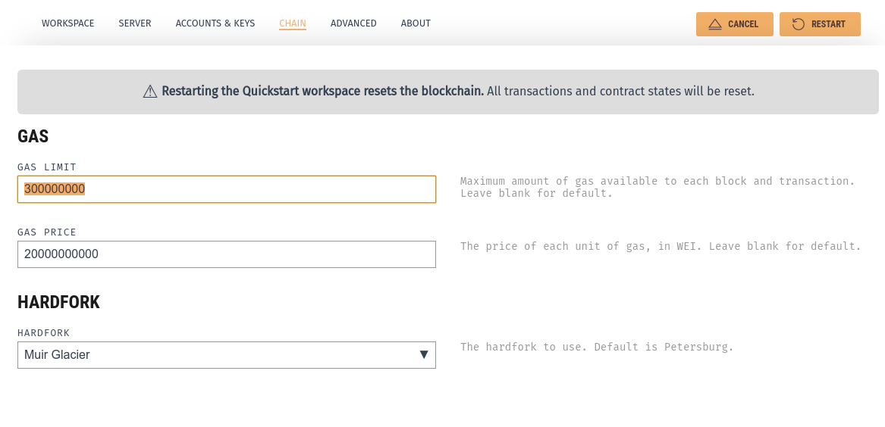

# ESV-React-DApp

[](https://nodesource.com/products/nsolid)

[](https://travis-ci.org/joemccann/dillinger)

ESV-React-DApp is a project skeleton for end-to-end battle-tested smart contract using various features of the Truffle Framework and the larger Ethereum ecosystem.

## Sūrya's Description Report

### Files Description Table

| File Name | SHA-1 Hash                               |
| --------- | ---------------------------------------- |
| ESV.sol   | f14261d7b7c5488f733fa1aab609f5a7404ae6a0 |

### Contracts Description Table

| Contract |              Type              |     Bases      |                |                   |
| :------: | :----------------------------: | :------------: | :------------: | :---------------: |
|    └     |       **Function Name**        | **Visibility** | **Mutability** |   **Modifiers**   |
|          |                                |                |                |                   |
| **ESV**  |         Implementation         |                |                |                   |
|    └     |         <Constructor>          |   Public ❗️   |       🛑       |       NO❗️       |
|    └     |        getContractOwner        |   Public ❗️   |                |       NO❗️       |
|    └     |        setESVItemCreate        |   Public ❗️   |       🛑       |    onlyAdmins     |
|    └     |           getESVItem           |   Public ❗️   |                |       NO❗️       |
|    └     |        getAllESVItemIDs        |   Public ❗️   |                |       NO❗️       |
|    └     |        getESVItemCount         |   Public ❗️   |                |       NO❗️       |
|    └     |        setESVItemDelete        |   Public ❗️   |       🛑       |    onlyAdmins     |
|    └     |   setESVItemSignatureUpdate    |   Public ❗️   |       🛑       |       NO❗️       |
|    └     | setMultiESVItemSignatureUpdate |   Public ❗️   |       🛑       |       NO❗️       |
|    └     |         bytesToAddress         |  Internal 🔒   |                |                   |
|    └     |        getMultiESVItem         |   Public ❗️   |                |       NO❗️       |
|    └     |     setMultiESVItemCreate      |   Public ❗️   |       🛑       |    onlyAdmins     |
|    └     |           quickSort            |  Internal 🔒   |                |                   |
|    └     |   setESVItemSignatureDelete    |   Public ❗️   |       🛑       |       NO❗️       |
|    └     |         setAdminCreate         |   Public ❗️   |       🛑       | onlyContractOwner |
|    └     |         setAdminDelete         |   Public ❗️   |       🛑       | onlyContractOwner |
|    └     |      setMultiAdminCreate       |   Public ❗️   |       🛑       | onlyContractOwner |
|    └     |      setMultiAdminDelete       |   Public ❗️   |       🛑       | onlyContractOwner |
|    └     |      getSignatureAddress       |   Public ❗️   |                |       NO❗️       |
|    └     |          getAllAdmins          |   Public ❗️   |                |       NO❗️       |
|    └     |       getSignatureCount        |   Public ❗️   |                |       NO❗️       |
|    └     |      getMessageHashCount       |   Public ❗️   |                |       NO❗️       |
|    └     |    getEthereumAddressCount     |   Public ❗️   |                |       NO❗️       |
|    └     |         getAdminCount          |   Public ❗️   |                |       NO❗️       |

### Legend

| Symbol | Meaning                   |
| :----: | ------------------------- |
|   🛑   | Function can modify state |
|   💵   | Function is payable       |

Contract Flow of ESV Smart Contract uaing [Surya](https://github.com/ConsenSys/surya)

#### Demo Tutorial

> **Tip:** To simulate a demo run of this repo simply run the following command:

    ```sh
    $ scriptreplay --timing=timing.txt session.txt
    ```

### IDE

- Solidity Code built and run using [Remix IDE](https://remix.ethereum.org/#optimize=false&runs=200&evmVersion=null&version=soljson-v0.7.4+commit.3f05b770.js&appVersion=0.7.7)

- Chai Tests and Mocha Assertions built and run using [Sublime 3](https://www.sublimetext.com/3)

- Python 3 Code built and run using [Visual Studio Code](https://code.visualstudio.com/)

### Prerequisites

1. Download [Ganache GUI](https://www.trufflesuite.com/ganache) for your Operating System

2. If on Ubuntu make the downloaded Ganache AppImage executable

   ```sh
   $ chmod +x ganache-2.5.4-linux-x86_64.AppImage
   ```

   **Note:** The Ganache version you use will probably be higher than the number specified in this README

3. Open the Ganache GUI

   ```sh
   $ ./ganache-2.5.4-linux-x86_64.AppImage
   ```

4. Click on **Quickstart** from the Ganache dashboard

   

5. Click on the _gear_ icon at the top right to go into Settings

   

6. Click into **Chain** on the top menu bar and increase the default Gas Limit to **300000000**

   

### Running Smart Contract Tests

1. Clone this project directory

   ```sh
   $ git clone https://github.com/prometheumlabs/ember-simple-verification.git
   ```

2. Clean Pre Existing Packages (Optional)

   ```sh
   $ cd ember-simple-verification/ && rm -rf node_modules/ && rm package-lock.json
   ```

3. Install NPM Packages

   ```sh
   $ npm install --legacy-peer-deps
   ```

   **Tip:** Do not try to patch security vulnerabilties of the install packages even when prompted on your Terminal to do so

4. Compile the solidity smart contracts

   ```sh
   $ truffle compile
   ```

5. Migrate the compiled smart contract bytecode to your local Ganache blockchain:

   ```
   $ truffle migrate --reset
   ```

   > **Tip:** The --reset flag ensures all old smart contract migrations are reset

6. List out the available smart contract functions on ESV
   ```
   $ cd src/contracts && surya describe ESV.sol
   ```
7. Run you Chai tests to ensure your smart contract functionality is working as expected
   ```sh
   $ truffle test
   ```
   > Check test coverage _(currently unsupported)_:
   ```sh
   $ truffle run coverage
   ```

## License

Prometheum

**Author**

_Srinjoy Chakravarty_
